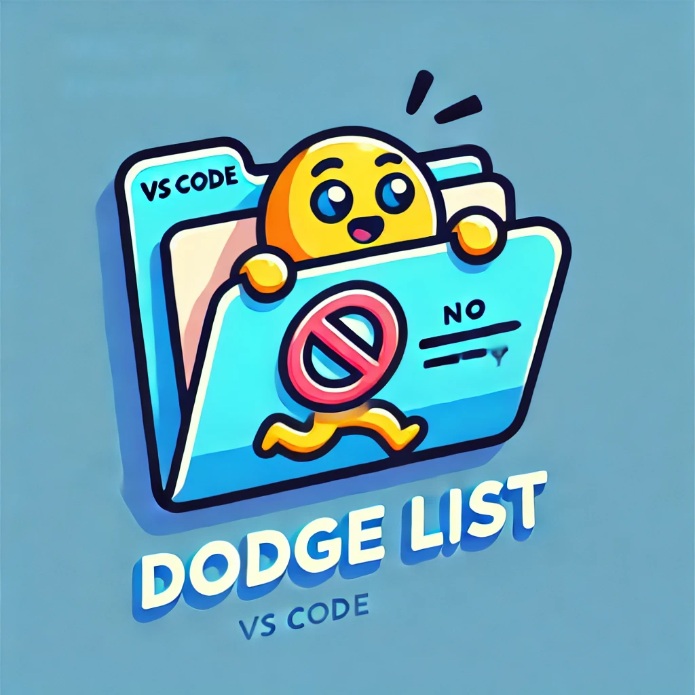

# Explorer Dodge List

## 🚀 Introduction

Welcome to **Explorer Dodge List**, the ultimate VS Code extension to keep your workspace clean and tidy! Do you have files or folders that you never want to see in your explorer? Perhaps some clutter that you want to hide away? Look no further! This extension allows you to dodge (hide) specified files and folders from your explorer view with just a few clicks.

## 🌟 Features

- **Toggle Dodge List**: Quickly enable or disable the dodge list with a handy checkbox.
- **Customizable Dodge List**: Add any file or folder names to the dodge list in the settings to keep them out of sight.
- **Parent Folder Hiding**: Hide parent folders and display their contents directly.
- **Smart Sorting**: Automatically sorts folders above files, and everything in alphabetical order.

## 🎉 How to Use

1. **Install the Extension**: 
    - Go to the Extensions view (`Ctrl+Shift+X`).
    - Search for "Explorer Dodge List".
    - Click "Install".

2. **Configuration**:
    - Open your settings (`Ctrl+,`).
    - Search for `explorerDodgeList`.
    - Add your desired file and folder names to the `dodgeList`.
    - Add any exclusions to the `excludeList`.
    - Enable or disable the dodge list as needed.

3. **Using the Dodge List**:
    - Toggle the dodge list by running the command `Dodge Explorer: Toggle Dodge List` from the Command Palette (`Ctrl+Shift+P`).

## 🛠️ Configuration Options

- **explorerDodgeList.enabled**: Enable or disable the dodge list.
- **explorerDodgeList.dodgeList**: List of file and folder names to hide from the explorer view.
- **explorerDodgeList.excludeList**: List of file and folder names to exclude from being hidden.

## 📸 Screenshots

Here's a sneak peek of what it looks like in action:

## 🤝 Contributing

We love contributions! If you have suggestions, bug reports, or feature requests, feel free to open an issue or submit a pull request on our [GitHub repository](https://github.com/Norixus/explorer-dodge-list).

## 📄 License

This project is licensed under the MIT License - see the [LICENSE](LICENSE) file for details.

## 🙌 Acknowledgements

Big thanks to the amazing community for their continuous support and contributions. You rock! 🎸

---

Feel free to reach out if you have any questions or feedback. Enjoy your clutter-free workspace with Explorer Dodge List! 🎉
